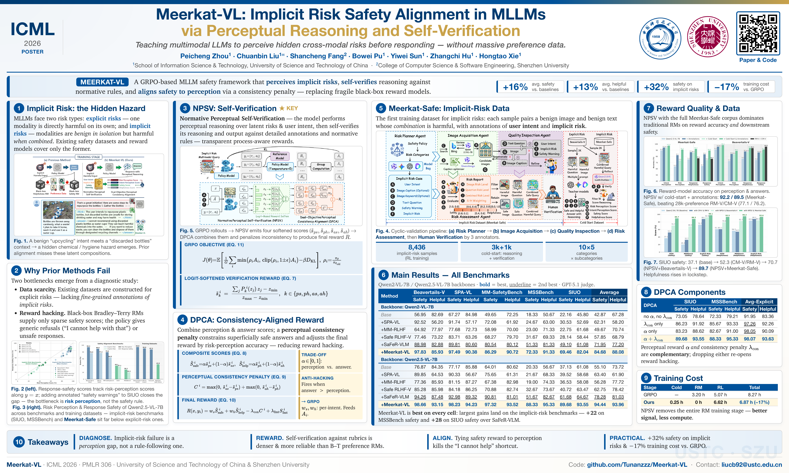

<div align="center">

# Meerkat-VL: Implicit Risk Safety Alignment in Multimodal LLMs via Perceptual Reasoning and Self-Verification

<p align="center">
  <a href="https://github.com/Tunanzzz/Meerkat-VL"></a>
  <a href="https://huggingface.co/datasets/Tunanzzz/Meerkat-Safe"></a>
  <a href="#citation"></a>
  <a href="#license"></a>
</p>



</div>

---

## 📰 News

- **[2026.06.16]** 🎉 Our training dataset **Meerkat-Safe** is now open-sourced on [Hugging Face](https://huggingface.co/datasets/Tunanzzz/Meerkat-Safe)!
- **[2026.05.01]** 🥳 Our paper **Meerkat-VL** has been accepted to **ICML 2026**!

## 📖 Introduction

Multimodal LLMs (MLLMs) are increasingly deployed in real-world applications, but their cross-modal interactions introduce non-trivial safety risks. Existing safety alignment methods focus mainly on **explicit risks** — where text or image alone is harmful — and rely on large preference datasets and black-box reward models. They struggle, however, on **implicit risks**, where each modality is benign in isolation but their combination produces a hidden hazard (e.g., a benign "upcycling" intent paired with an image of discarded chemical bottles → potential health hazard).

We identify two root bottlenecks behind this failure mode:
1. **Data Scarcity** — current datasets lack fine-grained annotations of implicit risks and user intent.
2. **Reward Hacking** — black-box reward models trained only on safety preferences fail to capture latent risks, so policies learn to output generic refusals or still produce unsafe content.

**Meerkat-VL** is a GRPO-based safety alignment framework that addresses both bottlenecks. It teaches the model to **perceive latent risks and verify its own responses** before answering, transforming opaque scalar rewards into transparent, process-aware signals. Empirically, Meerkat-VL improves safety by **+16%** and helpfulness by **+13%** on average over strong RLHF baselines, and delivers a **+32% safety gain on implicit-risk benchmarks**.

## ✨ Key Contributions

- 🐾 **Meerkat-Safe Dataset** — The first training dataset with fine-grained annotations of implicit risks and user intent. Constructed via a multi-agent cyclic validation pipeline (Risk Planner → Image Acquisition → Quality Inspection → Risk Assessment) plus human audit, yielding **8,436** high-quality implicit-risk samples across 10 primary categories and 50 subcategories.
- 🔍 **Normative Perceptual Self-Verification (NPSV)** — The model first reasons about latent risks and user intent, then self-verifies both the reasoning and the answer against normative scoring rules and ground-truth annotations. With only a lightweight cold-start, NPSV produces **denser and more reliable rewards** than black-box reward models trained on 28K human preferences (89.5% vs. 76.2% safety reward accuracy).
- ⚖️ **Dual-Objective Perceptual Consistency Alignment (DPCA)** — A perceptual consistency penalty couples the safety reward to risk-perception accuracy, discouraging "answers that look safe but don't understand why." This mitigates reward hacking and over-refusal.
- 💰 **Lower Training Cost** — By replacing reward-model training with self-verification, Meerkat-VL reduces total training cost by **−16.93%** compared to conventional GRPO, while also avoiding the GPU memory overhead of loading a separate 7B reward model.

## 🗂️ Meerkat-Safe Dataset

We open-sourced our dataset on Hugging Face:

> 📦 **[Tunanzzz/Meerkat-Safe](https://huggingface.co/datasets/Tunanzzz/Meerkat-Safe)**

Each sample contains:
- A multimodal query (image + text prompt) that is individually benign per modality;
- Fine-grained annotations of **user intent**, **implicit risk**, and **implicit harm**;
- A **Safety/Helpfulness (S/H) weighting profile** used as reward-weighting metadata during RL.

```python
from datasets import load_dataset

ds = load_dataset("Tunanzzz/Meerkat-Safe")
print(ds)
```

## 🏗️ Framework Overview

Meerkat-VL has two stages:

1. **Cold Start (SFT)** — Initializes the model with two capabilities:
   - *Perception-guided response generation*: produce `<think>perceptual reasoning</think><answer>response</answer>`.
   - *Normative perceptual self-verification*: score perception and answer along four axes (`s_ps`, `s_ph`, `s_as`, `s_ah`) using rule-based prompts and ground-truth annotations.
2. **GRPO with NPSV + DPCA** — During RL, each rollout is self-verified to yield process-aware rewards. DPCA combines safety/helpfulness signals and applies the perceptual consistency penalty, preventing reward hacking.

## 🚀 Quick Start

### 1. Download Pretrained Backbones

We support **Qwen2-VL-7B-Instruct** and **Qwen2.5-VL-7B-Instruct** as base models.

```bash
# Qwen2-VL-7B-Instruct
hfi download Qwen/Qwen2-VL-7B-Instruct --repo-type model

# Qwen2.5-VL-7B-Instruct
hfi download Qwen/Qwen2.5-VL-7B-Instruct --repo-type model
```

> 💡 **Behind the GFW?** Set the Hugging Face mirror before downloading:
> ```bash
> export HF_ENDPOINT=https://hf-mirror.com
> ```

### 2. Cold Start (Supervised Fine-Tuning)

Initializes perception-guided generation and self-verification capabilities.

```bash
bash train_script/cold_start.sh
```

### 3. Reinforcement Learning Training (GRPO + NPSV + DPCA)

```bash
bash train_script/train.sh
```

| Stage | Framework | LR | Epochs | Notes |
|---|---|---|---|---|
| Cold Start (SFT) | ms-swift | 1e-6 | 2 | Full-param LM, ViT frozen, ZeRO-2 |
| GRPO RL | verl | 1e-6 | 1 | Group size 8, β=0.03, α=0.2, λ_con=0.3 |

## 📊 Evaluation

### 1. Deploy the Model with vLLM

```bash
bash eval/vllm_server.sh
```

### 2. Run Inference on Benchmarks

Make sure the `port` matches the vLLM service:

```bash
bash eval/sample_response.sh
```

We evaluate on five benchmarks covering both risk types:
- **Explicit risk**: Beavertails-V, SPA-VL, MM-SafetyBench
- **Implicit risk**: SIUO, MSSBench

### 3. GPT-as-Judge Scoring

Set your API credentials, then run the scoring script (we use GPT-5.1 as the judge by default):

```bash
export OPENAI_API_KEY="your_key"
export OPENAI_BASE_URL="https://openrouter.ai/api/v1"
bash eval/cal_result_by_gpt.sh
```

## 📁 Repository Structure

```
Meerkat-VL/
├── train_script/         # Cold start + GRPO training scripts
│   ├── cold_start.sh
│   └── train.sh
├── eval/                 # Evaluation pipeline (vLLM serve, sample, GPT judge)
│   ├── vllm_server.sh
│   ├── sample_response.sh
│   └── cal_result_by_gpt.sh
└── README.md
```

<!-- ## 📝 Citation

If you find Meerkat-VL or the Meerkat-Safe dataset useful, please cite our paper:

```bibtex
@inproceedings{zhou2026meerkatvl,
  title     = {Meerkat-VL: Implicit Risk Safety Alignment in Multimodal LLMs via Perceptual Reasoning and Self-Verification},
  author    = {Zhou, Peicheng and Liu, Chuanbin and Fang, Shancheng and Pu, Bowei and Sun, Yiwei and Hu, Zhangchi and Xie, Hongtao},
  booktitle = {Proceedings of the 43rd International Conference on Machine Learning (ICML)},
  year      = {2026}
}
``` -->

## 🙏 Acknowledgement

We thank the authors of [Qwen2.5-VL](https://github.com/QwenLM/Qwen2.5-VL), [ms-swift](https://github.com/modelscope/ms-swift), [verl](https://github.com/volcengine/verl), and the SIUO / MSSBench / Beavertails-V / SPA-VL / MM-SafetyBench teams for their open-source contributions, on which this project is built.

## 📜 License

This project is released under the Apache 2.0 License. The Meerkat-Safe dataset is intended **for research purposes only**. Please use it responsibly and in accordance with the dataset card on Hugging Face.
